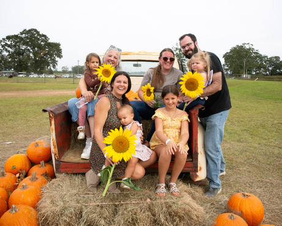
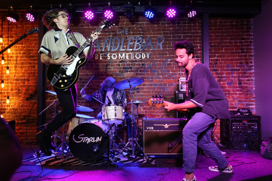
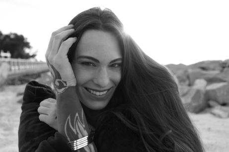

  <blockquote style="color:white">We capture all the sites 'cause art is unlimited.</blockquote>

<section>
  

    

      

        <h2>Portraiture</h2>
        
        

        There's something poignant about the honor of participating in such a personal and at times vulnerable aspect of documenting a family's story. 

        Peruse some select event family portraits in the <a href="portfolio#family_portraits">portfolio</a>.
        

      

    

    

      

        <h2>Events</h2>
        
        

        Having been involved in event production and performance from many different angles informs a robust approach to the various comlexities and facets of event photography. 

        Peruse some select event shots in the <a href="portfolio#events">portfolio</a>.
        

      

    

    

      

        <h2>Testimonials</h2>
        
        

          <blockquote>"Had such a great experience with Ric. He’s also good at cueing and posing you!"
            <cite>Wendy Pereira</cite>
          </blockquote>
          

          <blockquote>"I recently had a photoshoot with Ric SitesUnlimited Photography and it was so fun! When we were looking over the photos, I was blown away by the images! He captured my essence and intention behind the photos really well. I really enjoyed getting to shoot in this way. Looking forward to seeing them live on the page soon!"
            <cite>Kala Bloxham</cite>
          </blockquote>
          

          <blockquote>"Ric has an eye for beauty. I felt comfortable and confident during our photo shoot. He had great suggestions for poses and I felt at ease knowing they were going to turn out beautiful, and they did."
            <cite>Laura Meyer </cite>
          </blockquote>
          <a href="testimonials.html" style="text-align: right; display: block;">and more...</a>
        

      

    

  

</section>
